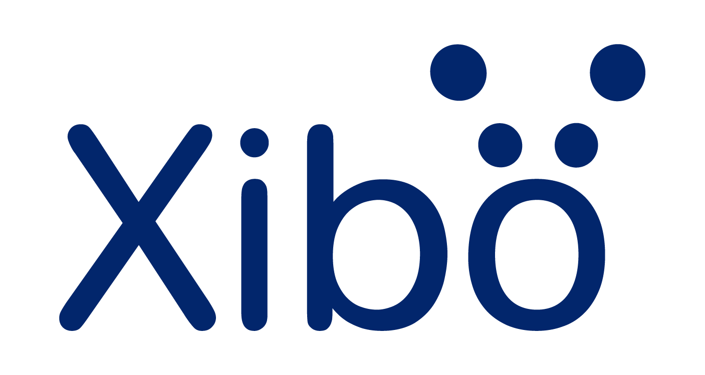

<picture>
  <source media="(prefers-color-scheme: dark)" srcset="xibologo.png">
  <source media="(prefers-color-scheme: light)" srcset="xibologo-blue.png">
  
</picture>

# The Xibo Open Source Promise

Xibo has always been an open source project at its heart. As our platform and community continue to grow, we want to formally codify our ongoing commitment to open source.

We are writing this down to provide clarity to the community that has grown alongside us. This document sets out what we are committing to, how we manage the project, and what we deliberately are not promising, so that you always know where we stand.

### What Xibo Is

Xibo is a complete, fully featured digital signage CMS. It is a robust platform used in production by organisations of every size, fully capable of powering real digital signage networks at scale. Xibo does have a selection of commercial features and capabilities which are not open source, such as compatibility with selected media player hardware. 

Xibo will continue to be actively developed, maintained, and improved. New platform capabilities and core engine updates will continue to land directly in the open source project.

### Our Open Source Commitments

We make the following firm commitments to our community:

* **The CMS Core:** The Xibo CMS core will remain open source on GitHub, developed under the AGPLv3 or later licence. Any version of the open source CMS we release under AGPLv3 remains available under AGPLv3 in perpetuity; that is a property of the licence, and we cannot revoke it.  
* **The Player apps:** The Windows and Linux player applications will remain freely available under an open source licence. You can deploy them across a full network with no software licensing costs.  
* **Community Contributions:** External contributions are welcome. We operate a Contributor Licence Agreement (CLA) and gladly accept bug fixes and small improvements through our public GitHub repositories.

### Project Boundaries

To be completely transparent and honest, it is equally important to outline what we are *not* promising:

* **Platform Evolution:** We are not promising that the specific feature set of Xibo today is frozen. We will continue to actively develop Xibo, and we reserve the right to refactor, reorganise, or restructure features as the platform evolves. This includes the right to deprecate or remove features when necessary (for example, for security, performance, or technological obsolescence).  
* **Feature Contributions:** While we welcome community input, we generally do not accept large-scale feature contributions. This is a deliberate choice to maintain project coherence and keep the long-term maintenance burden sustainable for our team.  
* **Governance:** Xibo Signage Ltd remains the sole steward of the project. 

### Why We Are Writing This Down

As Xibo scales to support more users and organisations globally, we want to ensure there is no uncertainty about our dedication to the open source core of our software. This document exists so that our community has a reliable foundation to build upon: a set of specific, public commitments, rather than a set of vague reassurances.

We are proud of what we have built together, and we are excited for the future of open source digital signage.