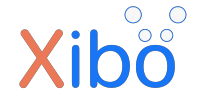

## About Xibo
Xibo is a powerful Open Source Digital Signage platform with a web content management system and Windows display player
software. We have commercial player options for Android, LG webOS and Samsung Tizen, as well as CMS hosting and support.

See [https://xibosignage.com](https://xibosignage.com) for more information.

Our first open source release 1.0.0-rc1 landed in 2009, and we're committed to keeping everything you need to run a
digital signage network, or single screen, open source and free to use.

## Licence

Copyright (C) 2006-2023 Xibo Signage Ltd and Contributors.

Xibo is free software: you can redistribute it and/or modify it under the terms of the GNU Affero General Public
License as published by the Free Software Foundation, either version 3 of the License, or any later version.

Xibo is distributed in the hope that it will be useful, but WITHOUT ANY WARRANTY; without even the implied warranty
of MERCHANTABILITY or FITNESS FOR A PARTICULAR PURPOSE.  See the GNU Affero General Public License for more details.

You should have received a copy of the GNU Affero General Public License along with Xibo. 
If not, see <http://www.gnu.org/licenses/>.

## Documentation
We have 3 types of documentation available to suit the audience: 

 * User: https://xibosignage.com/manual/en/
 * Administrator: https://xibosignage.com/docs/setup/
 * Developer: https://xibosignage.com/docs/developer/ (or `docs/` if you're more comfortable with markdown)

## Community
If you are looking for somewhere to discuss Xibo or ask about something that is not a **verified** bug, please head 
over to our [Community Discussion Page](https://community.xibo.org.uk).

## Releases
Release of our open source software are all published here on GitHub along with the source code. You can find them 
in their respective repositories.

### Repositories
This software is split across several repositories which mirror the different software components.

There is:
 - [Xibo](https://github.com/xibosignage/xibo) - Issues and developer documentation
 - [Xibo Docker](https://github.com/xibosignage/xibo-docker) - docker containers for our content management system
 - [Xibo CMS](https://github.com/xibosignage/xibo-cms) - the content management system
 - [Xibo for Windows Player](https://github.com/xibosignage/xibo-dotnetclient) - the windows player
 - [Xibo for Linux](https://github.com/xibosignage/xibo-linux) - the linux player (we need help with this player)
 - [Xibo Interactive](https://github.com/xibosignage/xibo-interactive-control) - a player side library for interactive control
 - [Xibo Message Relay - XMR](https://github.com/xibosignage/xibo-xmr) - Xibo Message Relay, a component of the CMS
 - [Xibo Support Library](https://github.com/xibosignage/support) - a small support library for doing common things in PHP
 - [Xibo Manual](https://github.com/xibosignage/xibo-manual) - the user manual
 - [PHP SDK for the CMS API](https://github.com/xibosignage/oauth2-xibo-cms) - league/oauth2 client for our CMS API

## Contributing
We would be delighted to accept contributions to the project - please refer to [CONTRIBUTING.md](CONTRIBUTING.md) 
for further information.

## Sponsorship
We've built commercial products and services on top of our open source project. If you want to support our work the
best way is to [become a customer](https://xibosignage.com/pricing). We're committed to keeping our project open 
source either way!
