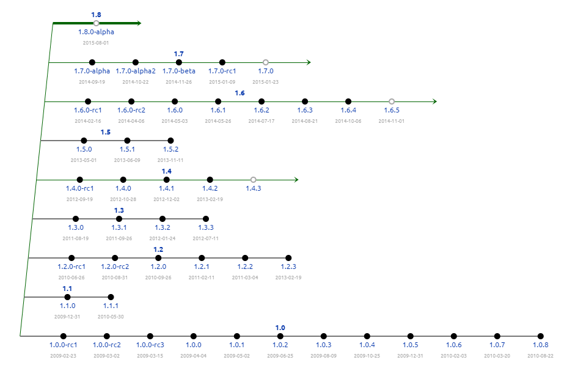

# Introduction
Open Source Digital Signage released under the AGPLv3. Powerful Open Source Digital Signage content management system and Windows / Ubuntu display player software. See [http://xibo.org.uk](xibo.org.uk) for more information.

## Repository Structure
This software is split across several repositories which mirror the different software components.

There is:
 - [Xibo CMS](https://github.com/xibosignage/xibo-cms)
 - Xibo for Chrome Player
 - Xibo for Windows Player
 - [Xibo for Ubuntu Player](https://github.com/xibosignage/xibo-pyclient)
 - [Xibo Manual](https://github.com/xibosignage/xibo-manual)
 - [Xibo CMS UI Test Suite](https://github.com/xibosignage/xibo-cms-tests)
 - Xibo Off-line Download Application

## Issues
Please track all issues in this repository here: https://github.com/xibosignage/xibo/issues

## Features
New features should be logged as issues and then documented in the Wiki here: https://github.com/xibosignage/xibo/wiki

## Developers
Developers should fork the repository of the software component in question and submit pull requests.

### Branching Model
Xibo uses the [http://nvie.com/posts/a-successful-git-branching-model/](Gitflow Branching Model), we would therefore like to encourage any contributors to read and understand that model so you know where to branch from / submit a pull request to.

We do have a slight adjustment to the model to support bug fixes into past releases, in that our release/x.x.x branches will only be removed when a subsequent release in that series is made. This branch should be used for hot fixes into that release.

# History
Xibo has been under development since 2008 and has had many successful releases. Prior to 1.7.0 our project was hosted on [Launchpad](https://launchpad.net/xibo/).

## Release History

