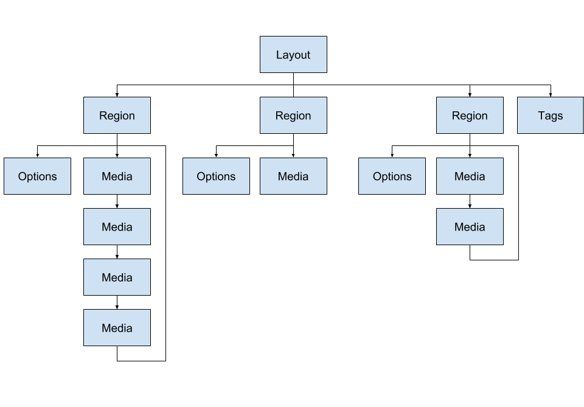

# Xibo Layout Format

XLF is a standard XML document used to completely describe a Layout and its resources. The CMS manages the creation of XLF files and will insure they are valid XML before transmission to the Player.

It is the Player's sole responsibility to parse the Layout files, request any necessary resources and put the Layout on screen for playback.

To simplify the explanation the XLF will be considered in two parts:

 - Structure
 - Media

## Structure
The Layout structure defines the Layout width, height and the Regions it is divided into. It is an XML document with the `<layout>` as the root node. Layouts are designed by the end user and can therefore have different combinations of Regions and Media.

*Note:* in 1.8 onward the CMS refers to "Widgets" being added to Region Timelines - for the Player this is translated into `<media>` nodes.

 

The structure part of a Layout XLF is shown below:

``` xml
<layout schemaVersion="3" width="1920" height="1080" background="126.jpg" bgcolor="#FF3399">
    <action layoutCode="" widgetId="" triggerCode="" targetId="" target="" sourceId="" source="layout" actionType="" triggerType="" id=""/>
    <region id="1" width="1920" height="1080" top="0" left="0" zindex="1">
        <action layoutCode="" widgetId="" triggerCode="" targetId="" target="" sourceId="" source="region" actionType="" triggerType="" id=""/>
        <media/>
		<options>
			<loop>0</loop>
			<transitionType></transitionType>
			<transitionDuration></transitionDuration>
			<transitionDirection></transitionDirection>
		</options>
    </region>
    <drawer id="">
    	<media/>
    </drawer>
	<tags>
		<tag>default</tag>
	</tags>
</layout>
```
This is a 1080p landscape Layout with a single full screen region.

A XLF will always have 1 Layout node (the root element of the document) and one or more region nodes. A Layout without any regions should be considered invalid.


### Layout
The Layout node provides the following options:

 - schemaVersion: The schema version for this Layout.
 - width: The Layout Width.
 - height: The Layout Height.
 - background: The path to the background image (optional).
 - bgcolor: A HEX colour for the background.
 - enableStat: A `0` or `1` to indicate whether a Layout Proof of Play should be recorded for this Layout or not. Only in 2.1+, should default to `1` if not present.


#### Dimensions 

The Player is responsible for rendering the Layout at the appropriate aspect ratio, according to its own dimensions. The Player might be full screen, or windowed and can be *any* resolution. It must therefore be capable of rendering a Layout at the largest width or height it can support, centrally on screen and to add "black bars" to each side.

The XLF provides the width/height of the Layout and the width/height/position of each Region. These are the dimensions the Layout was **designed** at - for example a Layout might be 1920x1080 in dimension. If the Player is 1920x1080 also, then a 1:1 rendering can occur, but if the player is 1280x720 or even 1080x1920, scaling must occur.


### Regions
The Region nodes provide the following options:

 - id: The `regionId`.
 - width: The Region width.
 - height: The Region height.
 - top: The Region position from the top of the Layout.
 - left: The Region position from the left of the Layout.
 - zindex: The order this Region should be drawn on the screen (0 first, with each new region on top).
 - options: A region node provides additional options in its `<options>` node. These are optional elements and should be provided with sensible defaults in the Player, possible options are shown below.


#### Loop

The Loop option is only applicable when there is only 1 media item in the region. It controls whether that one media item should be reloaded after it finished or not. When `loop = 0` the expired media item should be left on screen until the entire Layout has finished. When `loop = 1` the item should be removed and replaced with the same item again.

The default is 0 (don't loop) as the most common use case is to have a logo, text, clock, etc which you want to stay on screen for the whole time that other content it playing. You set its duration to something very low - e.g. 5 seconds - it expires fast and remains on screen until the other content has expired, at which point the whole Layout has expired and it is removed.


#### Transition
The Transitions attached to the Region are referred to as "Region Exit Transitions". They are the transition that should be shown when the Layout is finishing. Refer to the below [Transitions](#transitions) section for more information.


### Media
There are 3 terms in Xibo used to describe Media:

- Modules: A component in the software responsible for handling a particular type of file or data source, adding and configuring it, and rendering it.
- Media (in the CMS): Files Stored in the Library
- Media (in the XLF): Items to Play
- Widgets: A Module assigned to a Region Timeline or Playlist

Media nodes represent the Widgets added to the Region in the CMS - they could come from a Playlist or directly from the Region timeline. The CMS will pre-calculate which Widgets should be shown in a Region and will add them as Media nodes in the XLF. Media appears as `<media>` nodes within `<region>` nodes on a Layout. 

Media should be played in the order is appears in the XLF and looped once finished. The only time a Region is not looped is if there is only 1 Media node and the `loop` option is set to 0.

Media Nodes have attributes common to all types of Media and Options Nodes which are specific to the Media Module. There are set of core modules documented here, 3rd party modules should provide their own documentation notes.

``` xml
<media id="" duration="" type="" render="" enableStat="" toDt="" fromDt="">
    <action layoutCode="" widgetId="" targetId="" target="" sourceId="{the media nodes id}" source="widget" actionType="" triggerType="" id=""/>
	<options>
		<uri></uri>
		<transIn></transIn>
		<transInDuration></transInDuration>
		<transInDirection></transInDirection>
		<transOut></transOut>
		<transOutDuration></transOutDuration>
		<transOutDirection></transOutDirection>
	</options>
	<raw>

	</raw>
</media>
```

 - id: The `mediaId` of this media node (in 1.7 and later this is the CMS `widgetId`)
 - duration: The duration in seconds that this media item should be played (unless overridden as described below)
 - type: The type of media module
 - render: The render type, either `native` or `html`
 - enableStat: A `0` or `1` to indicate whether a Media Proof of Play should be recorded for this item or not. Only in 2.1+, should default to `1` if not present.
 - toDt and fromDt are the expiry dates set on the Widget, if not set specifically this will be min and max unix timestamp represented in a Y-m-d H:i:s format.
   Player should no longer show expired Widgets.
 - options -> uri: The uri of the save location as presented in `RequiredFiles`. This is common to all library based media.

If Widget comes from a subPlaylist Widget, then there are additional properties that will be added to the media node:

`parentWidgetId="" displayOrder="" playlist=""`

- parentWidgetId: is the Widget id of the subPlaylistWidget from which this Widget is pulled from
- displayOrder: order in which Widgets in the same Playlist should be displayed
- playlist: name of the Playlist from which this Widget is pulled from

In CMS version 3.1 and later additionally subPlaylist Widget can be configured with:

`cyclePlayback="" playCount="" isRandom="" `

Widgets belonging to the same Sub-Playlist are linked by `parentWidgetId` which Players should use to identify the Widget groups.

The `cyclePlayback` property comes from the SubPlaylist Widget, when cycle based playback is enabled only 1 Widget from this Sub-Playlist will be played each time the Layout is shown. The same Widget will be shown until the 'Play count' is achieved.

The `isRandom`  when enabled, random Widget from the same group should be selected at the start of each cycle and shown until its play count has been met.

The `playCount` is a number of plays Widget have before moving on.

Additional options may be present from **v5** onwards

``` xml
<media>
    <audio>
        <uri volume="100" loop="1" mediaId="12">1.mp4</uri>
    </audio>
    <commands>
        <command>code</command>
    </commands>
</media>
```


### Transitions

Media options include instructions for showing transitions at the start and end of each media item, described as In and Out. Each of the two transitions have the following 3 properties:

 - Type: The type of transition, currently supported are Fade In, Fade Out and Fly.
 - Duration: This is the duration in milliseconds that the transition should run for.
 - Direction: This is a compass point set of directions for the transition (only applicable for fly). N, NE, E, SE, S, SW, W, W, NW.


### Audio Nodes

Starting in **schema `v5`** the XLF may contain `<audio>` nodes. These are audio files that should be played at the start of a media item and should be executed by the Audio module. Audio can also exist as a Media node it is own right, unattached from another Media item.

An Audio node has child `<uri>` nodes which represent the audio file to play. Each node can also have a `volume` and `loop` attribute.


### Command Nodes
Starting in **v5** the XLF may contain one or more `<command>` nodes contained in a `<commands>` element. These are commands that should be executed in order when the media item is started. They should be executed by the Shell Command module.


## Actions

Starting in Xibo `v3` `<action>`s can be children of the `<layout>`, `<region>` or `<media>` nodes. Actions describe functionality from the interactive control module.

They have the following attributes:

- `id`: the actions id
- `actionType`: the type of action
- `triggerType`: either `touch` or `webhook`
- `source`: The source of the action, either `layout`, `region` or `widget`. This will be the same node as the action is a child of.
- `sourceId`: The id of the source.
- `target`: The target of the action, either `region` or `screen`.
- `targetId`: If the target is `region` then the id of the region we're targeting.
- `widgetId`: If we are navigating to a region, then this is the ID of the media node in the drawer.


### Drawer

A `<drawer>` node is provided which contains any `<media>` nodes that might be used in Actions. Media contained in the drawer doesn't get shown via normal operation and the drawer is essentially invisible.


# Example
Below is a complete Layout XLF for a Layout with a white background and 2 regions.

``` xml
<?xml version="1.0" encoding="UTF-8"?>
<layout width="1920" height="1080" resolutionid="9" bgcolor="#ffffff" schemaVersion="2" background="975.jpg">
   <tags>
      <tag>unittest</tag>
   </tags>
   <region id="1" userId="1" width="1812" height="132" top="57.1875" left="54.7875">
      <media id="1" type="text" render="native" duration="5">
         <options>
            <xmds>1</xmds>
            <effect>none</effect>
            <speed>0</speed>
            <backgroundColor />
         </options>
         <raw>
            <text><![CDATA[<p style="text-align: center;"><font color="#000000" face="lucida sans unicode, lucida grande, sans-serif"><span style="font-size: 80px;">Image Alignment Test</span></font></p>]]></text>
         </raw>
      </media>
   </region>
   <region id="2" userId="1" width="1816.8" height="772.79999999999" top="253.9875" left="54.7875">
      <media id="2" type="image" render="native" duration="10">
         <options>
            <uri>2.png</uri>
         </options>
         <raw />
      </media>
      <media id="3" type="image" render="native" duration="10">
         <options>
            <uri>3.png</uri>
            <scaleType>center</scaleType>
            <align>left</align>
            <valign>middle</valign>
         </options>
         <raw />
      </media>
      <media id="4" type="image" render="native" duration="10">
         <options>
            <uri>4.png</uri>
            <scaleType>center</scaleType>
            <align>right</align>
            <valign>middle</valign>
         </options>
         <raw />
      </media>
   </region>
</layout>
```
