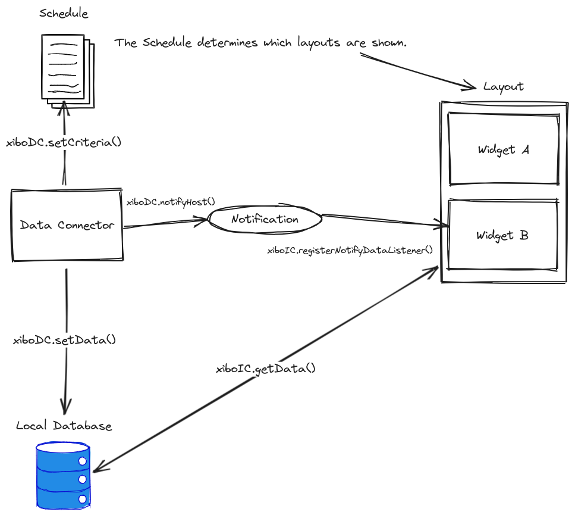

# Data Connectors

Data Connectors were added in Xibo v4.1 and are defined in the CMS attached to a DataSet which has been marked as "real time". Real time DataSets can be scheduled to players via the Schedule page.

Data Connectors persist across layout changes and changes to the schedule loop.

In a nutshell, the CMS is used to create the data structure definition, describe how it should be collected on the player and set when that should happen. The Player then runs the data connector, saves data to a local database and makes that available to widgets that need it.


The purpose of a data connector is to define JavaScript which will run on the Player, fetch data from a data source and make it available to widgets via `xiboIC`, or set schedule criteria.

The flow of data is described below:



While the data connector is running, it uses as helper class called `xiboDC` inform the player of a change in data or criteria. In both cases the player notifies interested parties of the change.

To be notified of new data, Widgets must register their interest in data changes and can then process those as needed. Widgets use `xiboIC` to getData once notified or as they need to.

## Initialisation

JavaScript in a Data Connector needs to define a window function called `onInit` which will be called when the JavaScript engine is ready.

```js
window.onInit = function() {
  // Start collecting data	
};
```

The JavaScript features available are player dependent and if you know that you will be using the Data Connector on older hardware, you should find out which web engine is available and code accordingly.

### Parameters

All Data Connectors have their parent `dataSetId` available as a window parameter. This can be used to set data for that `dataSetId` and update any Elements using it.

During scheduling is it possible to provide additional parameters in HTTP query format, e.g. `param1=one&param2=two`. These parameters are also made available as window parameters inside the Data Connector.


## Real time data

Data Connectors are responsible for connecting to a 3rd party data source, retrieving data and deciding when to pass that on.

### Retrieving data

Connecting to the 3rd party and retrieving data is left to the Data Connector developer.

For HTTP requests a utility function called `xiboDC.makeRequest()` is available with the following method signature. This request we will passed to the player to handle in native code.

```js
/**
 * Make a request using the player native HTTP client
 * @param  {string} path - Request path
 * @param  {Object} [options] - Optional params
 * @param  {string} [options.type]
 * @param  {Object[]} [options.headers]
 *  Request headers in the format {key: key, value: value}
 * @param  {Object} [options.data]
 * @param  {callback} [options.done]
 * @param  {callback} [options.error]
 */
xiboDC.makeRequest(path, {type, headers, data, done, error});
```

You can use any JavaScript supported by your player's web engine.

In due course we will be adding platform specific functionality for consuming data from Serial Ports, known sensor vendors, etc. If you have other use cases please [let us know](https://community.xibo.org.uk/c/dev).


### Setting data

Once data has been collected, Data Connectors can set it on the player and choose whether to notify widgets. This is accomplished in two steps.

#### Set data

To set data, Data Connectors can use `xiboDC.setData()` with the following method signature. Once set, data is available to any widgets running locally on the player. It is not available externally to the player.

```js
/**
 * Set data on the Player
 * @param {string} dataKey A dataKey to store this data
 * @param {String} data The data as string
 * @param {Object} options Additional options
 * @param {callback} options.done Optional
 */
xiboDC.setData(dataKey, data, {done});
```

Setting data happens asynchronously and therefore a `done` handler is provided.

Data should always be set as a string to avoid any differences between player types when data is retrieved.

If you are using the core "Real time data" widget with Elements or a core template, the data key you need to update is the `window.dataSetId`.

Example - Incrementing a timer:

```js
window.onInit = function() {
  let counter = 0;
  setInterval(function() {
    counter++;
    xiboDC.setData('timer', counter, {
      done: function() {
        xiboDC.notifyHost('timer');
      }
    });
  }, 1000);
}
```

In this example our Data Connector will initialise a counter at 0 and then update it once per second. Each time the counter updates, all interested widgets are notified, which is explained in the next section.

#### Notify

At an appropriate time, the Data Connector can notify all interested parties that data has been updated. This is done using `xiboDC.notifyHost()` with the following method signature.

```js
/**
 * Notify main application that we have new data.
 * @param {string} dataKey - The key of the data that has been changed.
 */
xiboDC.notifyHost(dataKey);
```

Usually the data key used to notify will be the same as the data key used to set data, as show in the timer example above.

The data key does not have to be the same as the data key of the `setData` operation, for example if you want to group multiple data keys together in one notification you could give another name for your widget to respond to.

If you are using the core "Real time data" widget with Elements or a core template, the data key listened for is the `window.dataSetId`.


## Schedule Criteria

Data Connectors can also set schedule criteria. Setting new schedule criteria will cause the schedule to be reassessed and all events criteria evaluated to build a new schedule loop.

Players may implement throttling on this function to maintain stability, please do not call it rapidly.

`xiboDC.setCriteria(metric, value, ttl)` is used to set criteria, with the following method signature.

```js
/**
 * Set Schedule Criteria
 * @param {string} metric the name of the metric to be set, this will be matched against  the metrics defined on the scheduled events criteria tab
 * @param {string} value the value to set, this can be a string, integer, boolean, etc
 * @param {int} ttl a time to live in seconds, 0 for permanent
 */
xiboDC.setCriteria(metric, value, ttl);
```

Example:

```js
// Indicate there is a goal and timeout after 30 seconds.
xiboDC.setCriteria('GOAL', true, 30);
```

## Testing

Data Connectors can be tested in the CMS using the "View Data Connector" page accessible via the row menu for its parent DataSet.

The Data Connector JavaScript is provided to the left, and a tabbed live view provided to the right, with the following tabs:

 - Test Params: A field to enter test params which will be made available to the Data Connector
 - Logs: Captured console logs
 - DataSet Data: A table representation of data who's data key matches the DataSet ID
 - Other Data: A JSON representation of data who's data key does not match the DataSet ID
 - Schedule Criteria: A table showing schedule criteria and their TTL


# Display on a Layout

Data from a Data Connector can be displayed on the player via:
 - Embedded widget
 - HTML package widget
 - Real time data widget

## Embedded / HTML widget

Widgets use `xiboIC` to be notified of changes to data and to request data for rendering. As with data supplied by the CMS, the widget is responsible for parsing, formatting and displaying it.

To work with real time data a widget must implement two functions:

 - `xiboIC.getData()`
 - `xiboIC.registerNotifyDataListener()`

### Get Data

Widgets can call `xiboIC.getData()` to retrieve data for a data key. Retrieval is asynchronous so a `done` callback function should be supplied to handle the data retrieved.

The done function will receive a status and a value. The value will be the stored data for that data key and will always be a string.

```js
/**
 * Get realtime data from the player.
 * @param {string} dataKey The key where this data is expected to be stored
 * @param {Object} [options] - Callbacks ptions
 * @param {callback} [options.done]
 * @param {callback} [options.error]
 */
xiboIC.getData(dataKey, {done, error});
```

### Notifications

Xibo has a notification listener in place which should be used to get an update when data changes. Widgets should avoid polling and redrawing.

To receive an update, the `xiboIC.registerNotifyDataListener()` should be called and given a single callback. Only one callback per widget is allowed.

```js
xiboIC.registerNotifyDataListener(function(dataKey) {
  console.log('Notify: ' + dataKey);
});
```

## Real time data widget

Xibo comes with a "real time data widget" module which will ask the user to choose a DataSet source which has "real time" enabled.

> This module is currently a placeholder and will be finalised before the release of v4.1.

### Templates

The real time data module can be extended with a module template for the "realtime" data type.

Templates can be added to the CMS using the "Developer -> Module Templates" menu, or by providing the XML files in the `custom` folder of the CMS installation.


## Testing

To test a real time data widget open it in the layout editor or preview with the Data Connector page open in another tab. Data collected by the Data Connector page will be shared across tabs and provided to the widget in the same way as it would in the player.

Changes on either side would require a tab refresh.

