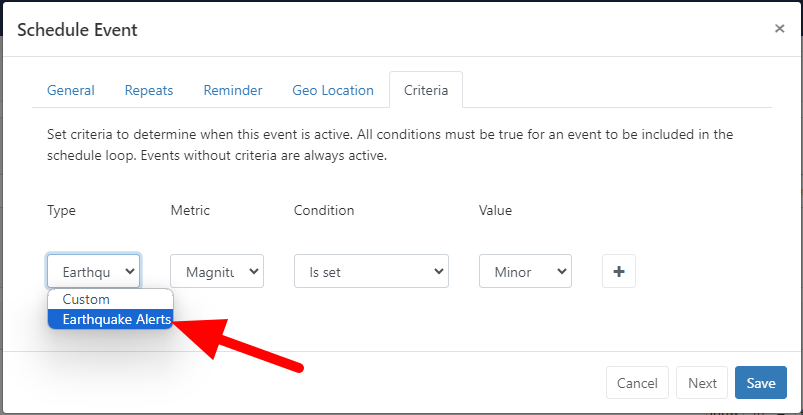

# Schedule Criteria

{tip}This feature will be included in Xibo v4.1 which is due to release in the first half of 2024.{/tip}

Schedule Criteria are a set of metrics set on the media player which influence the active schedule loop. Scheduled events in the CMS can have criteria configured against them, so that the event only becomes active when the criteria on the media player match.

For example a metric of "PRODUCT_LIFTED" could be set on the media player via API which activated a new scheduled layout in the loop to show information regarding the lifted product.

## API call
A POST request can be made to the player web server: `POST /criteria` containing a JSON array of criteria to add/update on the player.

```json
[
  {
    "metric": "metric",
    "value": "value",
    "ttl": 60
  }
]
```

## Data Connector
Data Connectors can also set schedule criteria. Setting new schedule criteria will cause the schedule to be reassessed and all events criteria evaluated to build a new schedule loop.

`xiboDC.setCriteria(metric, value, ttl)` is used to set criteria, with the following method signature.

```js
/**
 * Set Schedule Criteria
 * @param {string} metric the name of the metric to be set, this will be matched against  the metrics defined on the scheduled events criteria tab
 * @param {string} value the value to set, this can be a string, integer, boolean, etc
 * @param {int} ttl a time to live in seconds, 0 for permanent
 */
xiboDC.setCriteria(metric, value, ttl);
```

Example:

```js
// Indicate there is a goal and timeout after 30 seconds.
xiboDC.setCriteria('GOAL', true, 30);
```

## Frequency
Players may implement throttling on this function to maintain stability, please do not call it rapidly.

---

## Providing Schedule Criteria via Connector
This guide explains how to provide schedule criteria via a connector. By implementing the `ScheduleCriteriaProviderInterface`, connectors can supply types, metrics, and values for scheduling conditions. This ensures that the criteria are displayed correctly in the Schedule Criteria Form, allowing users to configure scheduling conditions based on the specified criteria.

## Interface for Managing Schedule Criteria Types, Metrics, and Values
Allows the addition of types, metrics, and values in a chained manner:

 - Start with `addType()` to add a new type. Call addType() multiple times to add multiple types.
 - Follow with `addMetric()` to add metrics under the specified type. Call addMetric() multiple times to add multiple metrics to the current type.
 - Conclude with `addValues()` immediately after addMetric() to specify a set of values for the metric. Each metric can have one set of values.
 - You can chain another `addMetric()` right after addValues() to add another metric.

The added criteria are then parsed and displayed in the Schedule Criteria Form, enabling users to configure scheduling conditions based on the specified types, metrics, and values. The PHP methods below detail the implementation for adding new types, metrics, and values.

```php
/**
 * Add a new type to the criteria.
 *
 * @param string $id Unique identifier for the type.
 * @param string $type Name of the type.
 * @return self
 */
public function addType(string $id, string $type): self;

/**
 * Add a new metric to the current type.
 *
 * @param string $id Unique identifier for the metric.
 * @param string $name Name of the metric.
 * @return self
 * @throws ConfigurationException If the current type is not set.
 */
public function addMetric(string $id, string $name): self;

/**
 * Add values to the current metric. The input type must be either "dropdown", "string", "date", or "number".
 *
 * The values array should be formatted such that the index is the id and the value is the title/name of the value.
 * For "dropdown" input type, provide an array of values. For other input types ("string", "date", "number"),
 * the values array should be empty "[]".
 *
 * Example values for "dropdown":
 * [
 *     'id1' => 'Value 1',
 *     'id2' => 'Value 2'
 * ]
 *
 * @param string $inputType Type of input for the values ("dropdown", "string", "date", "number").
 * @param array $values Array of values to be associated with the metric, where the index is the id and the value is
 * the title.
 * @return self
 * @throws ConfigurationException If the current type or metric is not set.
 */
public function addValues(string $inputType, array $values): self;
```

Below is a step-by-step implementation guide for providing data connector JavaScript via the connector in Xibo-CMS:

#### Step 1 - Create Custom Connector
Follow the documentation for creating a custom connector. You can find the detailed guide [here](https://xibosignage.com/docs/developer/extend/connectors).

#### Step 2 - Register Event Listener
Connectors that want to provide schedule criteria must register a listener for the `ScheduleCriteriaRequestEvent`.

```php
use Xibo\Event\ScheduleCriteriaRequestEvent;

public function registerWithDispatcher(EventDispatcherInterface $dispatcher): ConnectorInterface
{
    $dispatcher->addListener(ScheduleCriteriaRequestEvent::$NAME, [$this, 'onScheduleCriteriaRequest']);
    return $this;
}
```
#### Step 3 - Implement Event Handler
Implement the method that will handle the ScheduleCriteriaRequestEvent. This method will add types, metrics, and values
```php
use Xibo\Event\ScheduleCriteriaRequestInterface;

/**
 * @param ScheduleCriteriaRequestInterface $event
 * @return void
 * @throws ConfigurationException
 */
public function onScheduleCriteriaRequest(ScheduleCriteriaRequestInterface $event): void
{
    $event->addType('earthquake', 'Earthquake Alerts')
          ->addMetric('magnitude', 'Magnitude')
            ->addValues('dropdown', ['3.0-3.9' => 'Minor', '4.0-4.9' => 'Light', '5.0-5.9' => 'Moderate', '6.0-6.9' => 'Strong', '7.0+' => 'Major'])
          ->addMetric('location', 'Location')
            ->addValues('text', [])
          ->addMetric('region', 'Region')
            ->addValues('dropdown', ['Pacific Rim' => 'Pacific Rim', 'Ring of Fire' => 'Ring of Fire', 'East Coast' => 'East Coast', 'Midwest' => 'Midwest'])
          ->addMetric('alert_level', 'Alert Level')
            ->addValues('dropdown', ['Advisory' => 'Advisory', 'Watch' => 'Watch', 'Warning' => 'Warning']);
}
```
Then, it would be added to the form as shown below:

