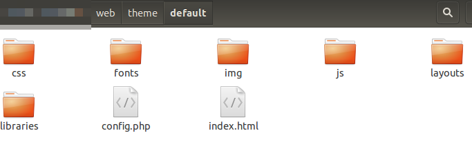
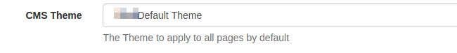

# Themes

The CMS has a theme system which allows a developer to customise the look and feel of the application by creating a theme and adding it to the `web/theme/custom` folder. The theme engine has been designed with the principle of inheritance in mind, meaning that any resource requested by the CMS is passed through the currently active theme and if that theme does not contain the resource, the default theme resource is served. This means that each theme **need only adjust the items required** and it is not necessary to take a whole copy of the default theme.

Themes are modelled as sub-folders under the `/theme/custom` folder. The theme folder is contained in the `/web` CMS installation folder. The default theme exists in a folder called "default".

The structure of the default theme is shown below:

 

Each theme has a simple config file called `config.php` which sets the title for the theme and some other meta data, for example the default theme `config.php` is:

```php
<?php
$config = array(
    'theme_name' => 'Xibo Default Theme',
    'theme_title' => 'Xibo Digital Signage',
    'app_name' => 'Xibo',
    'theme_url' => 'http://xibo.org.uk',
    'cms_source_url' => 'https://github.com/xibosignage/xibo/',
    'cms_install_url' => 'http://xibo.org.uk/manual/en/install_windows_client.html',
    'cms_release_notes_url' => 'http://xibo.org.uk/manual/en/release_notes.html'
);
```

The current CMS theme is activated in the General CMS Settings and is called `[[PRODUCTNAME]] Default Theme`. This list is automatically generated when a valid `config.php` file exists for a folder in `/theme/custom`.

 

## Basic Changes
Basic theme changes, such as minor modifications to the CSS can be achieved by providing an `override.css` file in your themes `/web/theme/custom/<theme>/css` folder. This CSS file is included as the **last** CSS include on all pages and can be used to override the CSS. The default version of this file is empty.

You may also include a `client.css` file which will be applied to all Widgets that render in HTML (such as embedded, ticker, etc). This is useful for applying global branding to all of your Displays.

## Advanced Changes
It is possible to change almost any part of the CMS's visual user interface.

The CMS uses the **Twig** engine for its view layer, with all of its views contained in the `/views` root folder. Each Twig view can be overridden by providing an alternative `view_path` setting in the theme `config.php` file. For example:

```php
$config['view_path'] = PROJECT_ROOT . '/custom/<theme>/views/';
```

You may store your custom views in the theme folder itself if you prefer - if you do this they will be accessible over the web. You must use the `PROJECT_ROOT` global constant which refers to the root of the Xibo installation.

> While it is possible to do this, we recommend treating the below as useful information for extending the CMS rather than modifying it. Overriding the core navigation/pages and forms means that you cannot cleanly upgrade to new versions of the software.

### Navigation
The CMS navigation bar is defined in `authed-sidebar.twig` and included in `authed.twig`. In versions prior to 1.8.3 the navigation bar was contained entirely in `authed.twig`.

### Pages
All pages in the CMS extend the `authed.twig` file, which in turn extends the `base.twig` file. Supplying an override to either of these files is the place to start customising the HTML/CSS of the CMS.

### Forms
Forms in Xibo are served over XHR and rendered by JavaScript in the browser. Each form extends the `form_base.twig` file.

# Docker
The Docker containers ship with volumes pre-mounted for all of the `/custom` folder locations mentioned above. Adding your files to these volumes will make those available to Xibo.

# Examples

## Changing the logo

A typical use case is to change the logo shown in the header. This example assumes that you do not have a theme yet. Create the following structure:

 - Create the `/web/theme/custom` folder if it does not exist
 - Create a sub-folder for your theme, for example `/web/theme/custom/mytheme`

Next you need to provide a config file for your theme at `/web/theme/custom/mytheme/config.php`

```php
<?php
$config = array(
    'theme_name' => 'My Theme',
    'theme_title' => 'My Theme',
    'app_name' => 'Xibo',
    'theme_url' => 'http://xibo.org.uk',
    'cms_source_url' => 'https://github.com/xibosignage/xibo/',
    'cms_install_url' => 'http://xibo.org.uk/manual/en/install_windows_client.html',
    'cms_release_notes_url' => 'http://xibo.org.uk/manual/en/release_notes.html'
);
```

The new theme can be activated in CMS settings under the Configuration tab. Do that now.

The CMS will now be checking your theme folder for all resources, including images, CSS and JavaScript. This means that we can drop a replacement logo into the theme and it will render that instead.

The default logo is stored in `/web/theme/default/img/xibologo.png` - take a copy of it and save it in `/web/theme/custom/mytheme/img/xibologo.png` and modify it according to your requirements.

## Adding a new link

A common example is to add a new link to the menu which directs the user to an external web page. This example assumes that you have created the theme shown in the "Changing the logo" example.

To provide a new link it is necessary to override one of the Twig views the CMS uses to render its content.

Add a custom view path to your `config.php` file in the `$config` array :

```php
$config['view_path'] => PROJECT_ROOT . '/web/theme/custom/mytheme/views',
```

You can then add Twig views to override the default views provided by the CMS, for example take a copy of `/views/authed-sidebar.twig`, save it in your `view_path` and add a new link at the appropriate place in the html.
