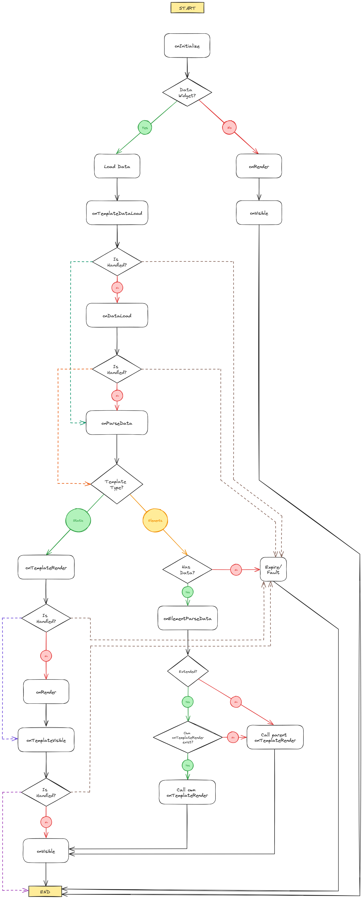

# Creating a Module

"Module" is Xibo's name for the logic which sits behind a Widget. Users create widgets, developers create modules.

{tip}Xibo `v4` has extensive changes to the way widgets are modelled and developed. If you are thinking of making a widget, we **recommend** using `v4` as your starting point.{/tip}

Xibo separates widget creation into two parts, the Module and then optionally the Template. All widgets must have a module, but only **widgets with data** will require a template. Templates can be reused across multiple modules, for example you may have multiple services providing social media data, all of which can be visualised by the same template.

* Module: is a library file or produces some HTML generated when it is saved, and does not change (unless changed by JavaScript).
* Template: is HTML/CSS/JavaScript applied to each item of data, and new data can be fed into the widget as it is playing.

Properties in the module will be shown on a "configure" tab in the Layout Editor, and properties in the template will be shown on an "appearance" tab.

Modules which are expected to supply data have the `dataType` property set. Xibo has some built in datatypes, such as article, social media, event, etc, but if these do not match the module it is possible to add new data types via XML.

## What do you want to create?

| I want to...                                                     | ...you need a                                                                                                                                                         |
|------------------------------------------------------------------|-----------------------------------------------------------------------------------------------------------------------------------------------------------------------|
| Upload a media file to assign directly to a Display.             | Module XML file with `regionSpecific=0` and `assignable=0`.                                                                                                           |
| Upload a media file and tell Xibo how to show it.                | Module XML file with `regionSpecific=0` and `assignable=1`.                                                                                                           |
| Create some reusable/configurable HTML for Layouts.              | Module XML file with `regionSpecific=1` and `assignable=1`.                                                                                                           |
| Create a new way to visualise an existing Widget which has data. | Template XML file with a matching `dataType`.                                                                                                                         |
| Pull, parse and display data on a Layout.                        | Module XML file with `regionSpecific=1`, `assignable=1`, a `dataType` and maybe a `class` or Connector. You also need a Template XML file with a matching `dataType`. |

### Hello World...

See [hello world](hello-world) for simple working examples of a Module. See [templates](templates) for a detailed look at how to create elements, stencils and static templates for Data Widgets.

### File locations

Xibo's module system uses XML, and where necessary PHP files for data retrieval, complex validation and upgrading.

These files are located in the following places:

| Type                | Location                                                 |
|---------------------|----------------------------------------------------------|
| Core module XML     | `/modules`                                               |
| Core template XML   | `/modules/templates`                                     |
| Core datatype XML   | `/modules/datatypes`                                     |
| Custom module XML   | `/custom/modules`                                        |
| Custom template XML | `/custom/modules/templates`                              |
| Custom datatype XML | `/custom/modules/datatypes`                              |
| Custom PHP          | `/custom` (Autoloaded from the `\Xibo\Custom` namespace) |

### XML definitions
Definitions for module and template XML files can be found in [XML definitions](xml-definitions).


## Saving, previewing and generating HTML

### Properties

Properties declared in either the module or template XML will be shown on the widget edit form in the Layout Editor and saved with the Widget. Properties from the module will be shown in the "Configure" tab, and properties from the template will be shown in the "Appearance" tab.

The users choices will be saved with the widget and automatically available when rendering a stencil from Twig or Handlebars. If the user does not make a choice, any default value will be used.

### Generating HTML

Each time the widget is saved, the module and template XML stencils will be used to generate and cache the Widget HTML, which will subsequently be sent to players as necessary. HBS content in the stencils will be rendered at playtime.

### Working with Data

Modules with data will need to supply a `dataType` property and should ensure that this is unique to the CMS. There are two ways to provide data for a `dataType`, see "Providing Data" below.

### Previewing

A module has the opportunity to provide an alternative preview using the `preview` option. If this is not provided the full HTML will be shown instead.


## Render flow

### How it works

The rendering flow of a module is how the content is created, based on the data that is passed in to the module. All methods are optional, and run in sequence.

The `onInitialize` method is the first to run, and is mostly used to set up the variables and methods that will be used in the rendering process.

If the module has a data type, this is followed by either `onDataLoad` or `onDataError` depending on whether the data is cached and ready to use.

This is followed by the `onParseData` method, which is used to parse and transform the data for each item that comes from the provider.

Next the rendering method `onRender` and `onTemplateRender` run in sequence. The `onRender` method is used to render the HTML for the module, and the `onTemplateRender` method is used to render the HTML for the template. If they are not present, a default render method is used to render and scale the module appropriately.

Finally, the `onVisible` method is used to start any animations that may be required.

### Methods

#### `onInitialize`, `onRender`, `onVisible`

Called on the module.

| Name         | Description                            |
|--------------|----------------------------------------|
| `id`         | The id of the widget                   |
| `target`     | The module HTML container              |
| `items`      | The data items                         |
| `properties` | The properties of the module           |
| `meta`       | The meta data provided by the provider |

#### `onDataLoad`

Called on any data returned by the provider.

| Name         | Description                            |
|--------------|----------------------------------------|
| `items`      | The data items                         |
| `meta`       | The meta data provided by the provider |
| `properties` | The properties of the module           |

#### `onDataError`

Called if data is expected and the provider doesn't return any

| Name         | Description                         |
|--------------|-------------------------------------|
| `httpStatus` | The HTTP status code of the request |
| `response`   | The response body                   |

#### `onParseData`

Called on each data item returned by the provider.

| Name         | Description                            |
|--------------|----------------------------------------|
| `item`       | The data item                          |
| `properties` | The properties of the module           |
| `meta`       | The meta data provided by the provider |

#### `onTemplateRender`

Called on the template.

| Name         | Description                            |
|--------------|----------------------------------------|
| `id`         | The id of the widget                   |
| `target`     | The module HTML container              |
| `items`      | The data items                         |
| `properties` | The properties of the module           |
| `meta`       | The meta data provided by the provider |

> **Note:** Both `onRender` and `onTemplateRender` are called multiple times when changing the dimensions of the preview window. If set, the methods needs to be able to clear the previous render in each call.

#### `onElementParseData`

Elements only.

| Name         | Description                  |
|--------------|------------------------------|
| `value`      | The element value            |
| `properties` | The properties of the module |

### Flow Diagram



## Replacements

In the module `hbs` template, with [handlebar expressions](https://handlebarsjs.com/guide/#what-is-handlebars) we can use module properties and template properties to render and structure the content.

```xml
<hbs><![CDATA[
<h1>{{name}}</h1>
{{#eq showAge 1}}
    <p>Age: {{age}}</p>
{{/eq}}
]]></hbs>
```

In the `twig` template, we can also use variables and expression from the [Twig template engine](https://twig.symfony.com/doc/2.x/templates.html) to render the content.

```xml
<twig><![CDATA[
<style>
    .name {
        font-size: {{fontSize}}px;
    }

    .age {
        display: none;
    }

]]></twig>
```

## Using the Xibo Interactive Control

[Xibo Interactive Control](https://github.com/xibosignage/xibo-interactive-control) is a JavaScript helper library used primarily to send actions from Widgets running in Xibo's built in Web Browser, to the Player application itself on its local web server.

But that tool can also be used to store and retrieve data during the execution of a Widget. That means we can store data in a rendering method and retrieve it in another one.

### Store data

To store data, we can use the `xiboIC` object, which is available globally in the `window` object.

Store variable:

```javascript
xiboIC.set('myData', 'Hello World');
```

Store method:

```javascript
xiboIC.set('myMethod', function() {
    return 'Hello World';
});
```

### Retrieve data

In a different method, we can then retrieve the data using the `xiboIC` object.

Retrieve variable:

```javascript
var myData = xiboIC.get('myData');
console.log(myData);
```

Retrieve method:

```javascript
var myMethod = xiboIC.get('myMethod');
console.log(myMethod());
```

## Providing data
If you're creating a template data will be provided by one of the existing modules without any further action.

If you want to make a new data source available for an existing data type, or you're creating a module and templates
for a completely new data type; you will need to implement a [data provider](data-providers).
